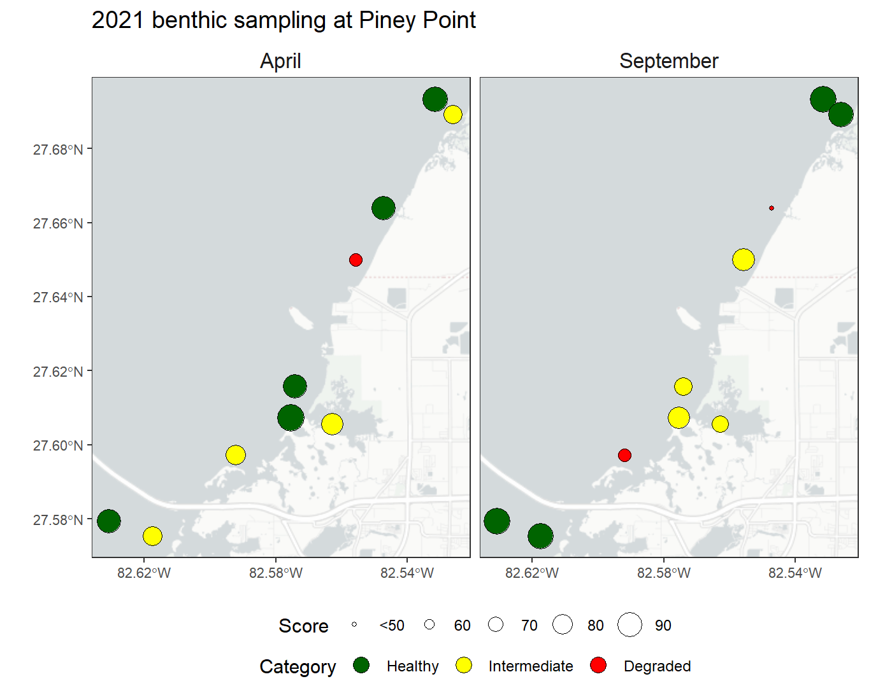

```{r setup, echo = FALSE, message = F, warning = F, results = 'hide'}

knitr::opts_chunk$set(echo = FALSE, warning = FALSE, message = FALSE, fig.height = 6, fig.width = 9)

library(tbeptools)
library(tidyverse)
library(lubridate)
library(sf)
library(ggmap)
library(ggspatial)
library(patchwork)
library(units)
library(grid)
library(scales)
library(mapview)
library(leaflet)

data(rsbntdat)
data(rsbntpts)

source("R/funcs.R")

# ggplot theme
thm <- theme_minimal(base_size = 14) +
  theme(
    legend.position = 'top', 
    legend.title = element_blank(),
    panel.grid.major.x = element_blank(), 
    panel.grid.minor.x = element_blank(),
    strip.background = element_blank(), 
    strip.text = element_text(size = 14), 
    axis.title.x = element_blank(), 
    axis.ticks.x = element_line(), 
    axis.text.x = element_text(angle = 45, hjust = 1, size = 10), 
    panel.grid.minor.y = element_blank()
  )

buffpts <- rsbntpts %>% 
  st_transform(crs = 6443) %>%
  st_buffer(dist = 1.5e4) %>% 
  st_transform(crs = 4326) %>% 
  st_geometry() %>% 
  st_union()

# response benthic data
rsbntdat <- rsbntdat %>% 
  mutate(
    yr = year(date)
  ) %>% 
  select(station, modt, yr, col, TBBI, TBBICat)
  
# baseline score
bsbntdat <- anlz_tbbiscr(benthicdata) %>% 
  st_as_sf(coords = c('Longitude', 'Latitude'), crs = 4326) %>% 
  .[buffpts, ] %>% 
  mutate(
    col = dplyr::case_when(
      TBBICat == 'Empty Sample' ~ 'grey', 
      TBBICat == 'Degraded' ~ 'red', 
      TBBICat == 'Intermediate' ~ 'yellow', 
      TBBICat == 'Healthy' ~ 'darkgreen', 
    ),
    StationID = as.character(StationID)
  ) %>% 
  filter(AreaAbbr %in% c('LTB', 'MTB')) %>% 
  select(station = StationID, date, yr, col, TBBI, TBBICat) %>% 
  filter(yr != 2021)

# all bntdata
bntdat <- bsbntdat %>% 
  st_set_geometry(NULL) %>% 
  select(station, yr, col, TBBI, TBBICat) %>% 
  bind_rows(rsbntdat) %>% 
  arrange(yr) %>% 
  mutate(
    TBBICat = factor(TBBICat, levels = c('Degraded', 'Intermediate', 'Healthy'))
  )
```

April 2021 samples with buffer area used to subset historical benthic data. 

```{r, out.width = '100%'}
tomap <- rsbntdat %>%
  dplyr::filter(modt == 'April 2021') %>% 
  left_join(rsbntpts, ., by = 'station')

# response benthic sampling base map
out <- mapview(tomap, homebutton = F, legend = F) %>% 
  .@map %>% 
  clearMarkers() %>%
  addPolygons(
    data = buffpts, 
    stroke = F
  ) %>% 
  addCircleMarkers(
    data = tomap,
    layerId = ~station,
    stroke = TRUE,
    color = 'black',
    fill = TRUE,
    fillColor = ~col,
    weight = 1,
    fillOpacity = 1,
    radius= 6,
    label = ~paste0('Station: ', station, ' (', source_lng, '), ', TBBICat)
  ) %>% 
  addLegend("topright", title = 'April 2021 benthic condition', opacity = 1, labels = c('Healthy', 'Intermediate', 'Degraded'), colors = c('darkgreen', 'yellow', 'red')) %>% 
    addLegend("topright", title = 'Buffer area', opacity = 0.5, colors = "#03F", labels = '')

out
```

September 2021 samples with buffer area used to subset historical benthic data. 

```{r, out.width = '100%'}
tomap <- rsbntdat %>%
  dplyr::filter(modt == 'September 2021') %>% 
  left_join(rsbntpts, ., by = 'station')

# response benthic sampling base map
out <- mapview(tomap, homebutton = F, legend = F) %>% 
  .@map %>% 
  clearMarkers() %>%
  addPolygons(
    data = buffpts, 
    stroke = F
  ) %>% 
  addCircleMarkers(
    data = tomap,
    layerId = ~station,
    stroke = TRUE,
    color = 'black',
    fill = TRUE,
    fillColor = ~col,
    weight = 1,
    fillOpacity = 1,
    radius= 6,
    label = ~paste0('Station: ', station, ' (', source_lng, '), ', TBBICat)
  ) %>% 
  addLegend("topright", title = 'September 2021 benthic condition', opacity = 1, labels = c('Healthy', 'Intermediate', 'Degraded'), colors = c('darkgreen', 'yellow', 'red')) %>% 
    addLegend("topright", title = 'Buffer area', opacity = 0.5, colors = "#03F", labels = '')

out
```

Subset historical data.

```{r, out.width = '100%'}
tomap <- bsbntdat

# response benthic sampling base map
out <- mapview(tomap, homebutton = F, legend = F) %>% 
  .@map %>% 
  clearMarkers() %>%
  addPolygons(
    data = buffpts, 
    stroke = F
  ) %>% 
  addCircleMarkers(
    data = tomap,
    layerId = ~station,
    stroke = TRUE,
    color = 'black',
    fill = TRUE,
    fillColor = ~col,
    weight = 1,
    fillOpacity = 1,
    radius= 6,
    label = ~paste0('Station: ', station, ' (', yr, '), ', TBBICat)
  ) %>% 
  addLegend("topright", title = '1993-2020 benthic condition', opacity = 1, labels = c('Healthy', 'Intermediate', 'Degraded'), colors = c('darkgreen', 'yellow', 'red')) %>% 
    addLegend("topright", title = 'Buffer area', opacity = 0.5, colors = "#03F", labels = '')

out
```

TBBI categories by sample (top) and average TBBI scores (bottom), historical and 2021. Bottom plot only includes years with > 2 samples.  Breakpoints for TBBI categories in the bottom are shown by the colors.

```{r, fig.width = 9, fig.height = 8}
alph <- 0.4
perc <- c(73, 87)

toplo1 <- bntdat 
toplo2 <- bntdat %>% 
  group_by(yr) %>% 
  mutate(
    cnt = n()
  ) %>% 
  filter(cnt > 2) %>% 
  summarise(
    avev = mean(TBBI), 
    lov = t.test(TBBI)$conf.int[1], 
    hiv = t.test(TBBI)$conf.int[2]
  )

p1 <- ggplot(toplo1, aes(x = yr)) + 
  geom_bar(stat = 'count', alpha = alph, aes(fill = TBBICat), colour = 'grey') + 
  labs(
    y = 'Samples'
  ) +
  scale_fill_manual(values = c('red', 'yellow', 'forestgreen')) + 
  scale_x_continuous(breaks = seq(min(toplo1$yr), max(toplo1$yr)), expand = c(0, 0)) +
  scale_y_continuous(expand = c(0, 0)) + 
  coord_cartesian(ylim = c(0, NA)) +
  thm

p2 <- ggplot(toplo2, aes(x = yr, y = avev)) + 
  annotate("rect", xmin = -Inf, xmax = Inf, ymin = -Inf, ymax = perc[1], alpha = alph, fill = 'red') +
  annotate("rect", xmin = -Inf, xmax = Inf, ymin = perc[1], ymax = perc[2], alpha = alph, fill = 'yellow') +
  annotate("rect", xmin = -Inf, xmax = Inf, ymin = perc[2], ymax = Inf, alpha = alph, fill = 'forestgreen') +
  geom_point(size = 2) + 
  geom_line() + 
  geom_errorbar(aes(ymin = lov, ymax = hiv)) +
  labs(
    y = 'Mean TBBI score (+/- 95% CI)'
  ) +
  # scale_fill_manual(values = c('red', 'yellow', 'forestgreen')) + 
  scale_x_continuous(breaks = seq(min(toplo2$yr), max(toplo2$yr)), expand = c(0, 0)) +
  scale_y_continuous(expand = c(0, 0)) + 
  coord_cartesian(ylim = c(50, NA)) +
  thm + 
  theme(
    axis.ticks.y = element_line(), 
    panel.grid.major.y = element_blank()
    )

p1 + p2 + plot_layout(ncol = 1)
```

TBBI categories by sample (left) and average TBBI scores (right), April/September 2021 results only. Breakpoints for TBBI categories in the right are shown by the colors.

```{r, fig.width = 8, fig.height = 5, fig.align = 'center'}
alph <- 0.4
perc <- c(73, 87)

toplo1 <- rsbntdat 
toplo2 <- rsbntdat %>% 
  group_by(modt) %>% 
  mutate(
    cnt = n()
  ) %>% 
  filter(cnt > 2) %>% 
  summarise(
    avev = mean(TBBI), 
    lov = t.test(TBBI)$conf.int[1], 
    hiv = t.test(TBBI)$conf.int[2]
  )

p1 <- ggplot(toplo1, aes(x = modt)) + 
  geom_bar(stat = 'count', alpha = alph, aes(fill = TBBICat), colour = 'grey') + 
  labs(
    y = 'Samples'
  ) +
  scale_fill_manual(values = c('red', 'yellow', 'forestgreen')) + 
  scale_x_discrete(expand = c(0, 0)) +
  scale_y_continuous(expand = c(0, 0)) + 
  coord_cartesian(ylim = c(0, NA)) +
  thm

p2 <- ggplot(toplo2, aes(x = modt, y = avev)) + 
  annotate("rect", xmin = -Inf, xmax = Inf, ymin = -Inf, ymax = perc[1], alpha = alph, fill = 'red') +
  annotate("rect", xmin = -Inf, xmax = Inf, ymin = perc[1], ymax = perc[2], alpha = alph, fill = 'yellow') +
  annotate("rect", xmin = -Inf, xmax = Inf, ymin = perc[2], ymax = Inf, alpha = alph, fill = 'forestgreen') +
  geom_point(size = 2) + 
  geom_errorbar(aes(ymin = lov, ymax = hiv)) +
  labs(
    y = 'Mean TBBI score (+/- 95% CI)'
  ) +
  thm + 
  theme(
    axis.ticks.y = element_line(),
    panel.grid.major.y = element_blank()
    )

p1 + p2 + plot_layout(ncol = 2, guides = 'collect') & theme(legend.position = 'top')
```

Same results as above, but without station 21PP03.

```{r, fig.width = 8, fig.height = 5, fig.align = 'center'}
alph <- 0.4
perc <- c(73, 87)

toplo1 <- rsbntdat %>% 
  filter(!station == '21PP03')
toplo2 <- toplo1 %>% 
  group_by(modt) %>% 
  mutate(
    cnt = n()
  ) %>% 
  filter(cnt > 2) %>% 
  summarise(
    avev = mean(TBBI), 
    lov = t.test(TBBI)$conf.int[1], 
    hiv = t.test(TBBI)$conf.int[2]
  )

p1 <- ggplot(toplo1, aes(x = modt)) + 
  geom_bar(stat = 'count', alpha = alph, aes(fill = TBBICat), colour = 'grey') + 
  labs(
    y = 'Samples'
  ) +
  scale_fill_manual(values = c('red', 'yellow', 'forestgreen')) + 
  scale_x_discrete(expand = c(0, 0)) +
  scale_y_continuous(expand = c(0, 0)) + 
  coord_cartesian(ylim = c(0, NA)) +
  thm

p2 <- ggplot(toplo2, aes(x = modt, y = avev)) + 
  annotate("rect", xmin = -Inf, xmax = Inf, ymin = -Inf, ymax = perc[1], alpha = alph, fill = 'red') +
  annotate("rect", xmin = -Inf, xmax = Inf, ymin = perc[1], ymax = perc[2], alpha = alph, fill = 'yellow') +
  annotate("rect", xmin = -Inf, xmax = Inf, ymin = perc[2], ymax = Inf, alpha = alph, fill = 'forestgreen') +
  geom_point(size = 2) + 
  geom_errorbar(aes(ymin = lov, ymax = hiv)) +
  labs(
    y = 'Mean TBBI score (+/- 95% CI)'
  ) +
  thm + 
  theme(
    axis.ticks.y = element_line(),
    panel.grid.major.y = element_blank()
    )

p1 + p2 + plot_layout(ncol = 2, guides = 'collect') & theme(legend.position = 'top')
```

A simple map comparing April/September results for 2021. 

```{r, results = 'hide'}
toplo <- rsbntpts %>% 
  left_join(rsbntdat, by = 'station') %>% 
  select(station, TBBI, TBBICat, col, modt) %>% 
  mutate(
    TBBI = pmax(50, TBBI),
    modt = gsub('\\s2021$', '', modt),
    modt = factor(modt, levels = c('April', 'September'))
    )

p <- ggplot() + 
  annotation_map_tile(zoom = 12, type = 'cartolight') +
  geom_sf(data = toplo, aes(fill = TBBICat, size = TBBI), pch = 21) +
  scale_fill_manual(values = setNames(toplo$col, toplo$TBBICat)) +
  scale_x_continuous(breaks = seq(-82.62, -82.54, by = 0.04)) +
  # scale_y_continuous(breaks = seq(27.58, 27.68, by = 0.04)) +
  scale_radius(range = c(1, 7), breaks = c(50, 60, 70, 80, 90), labels = c('<50', '60', '70', '80', '90')) +
  facet_wrap(~modt, ncol = 2) +
  guides(fill = guide_legend(override.aes = list(size = 4))) +
  theme_bw() +
  theme(
    strip.background = element_blank(), 
    strip.text = element_text(size = 12), 
    axis.text = element_text(size = 8), 
    legend.position = 'bottom', 
    legend.box = 'vertcal',
    legend.spacing = unit(-0.2, "cm")
  ) +
  labs(
    fill = 'Category', 
    size = 'Score', 
    title = "2021 benthic sampling at Piney Point"
  )

png('figure/benthmap.png', height = 5.5, width = 7, units = 'in', res = 200)
print(p)
dev.off()
```

```{r}

```

